# Starter-Rocketseat
https://app.rocketseat.com.br/node/curso-java-script-es-6

## Modulo 1

  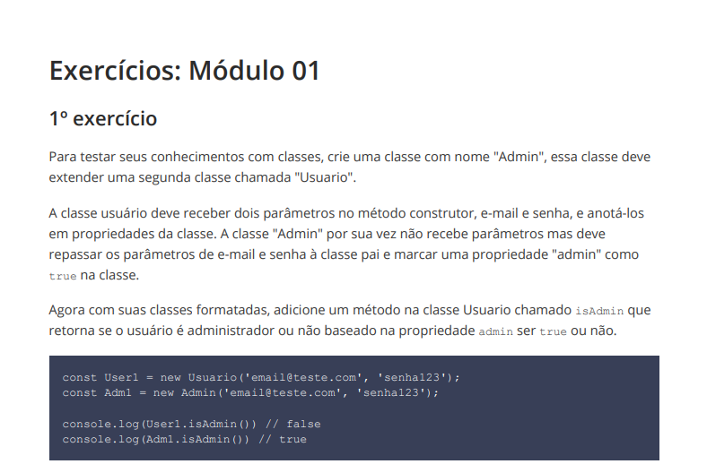

 

  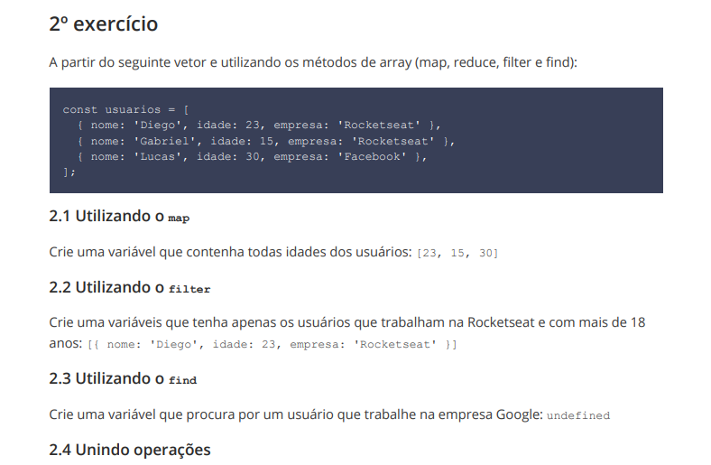

 

  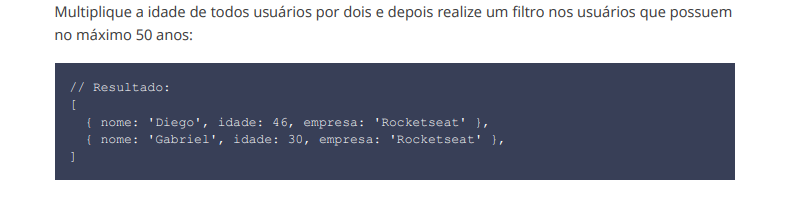

 

  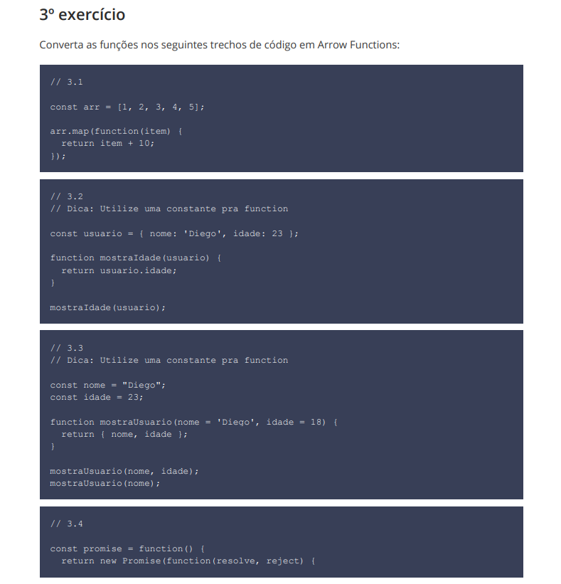

 

  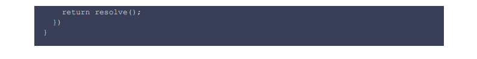

  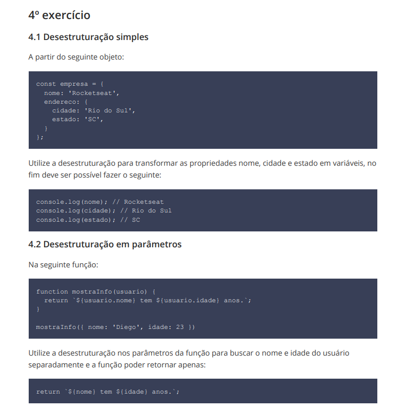

  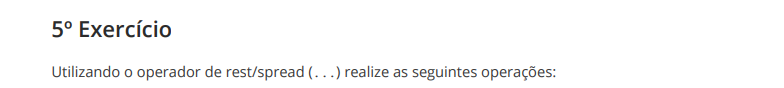

  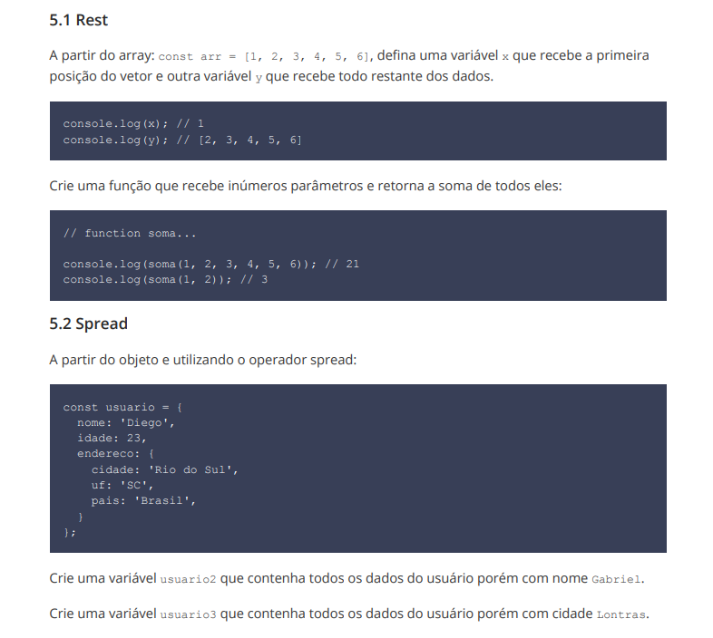

  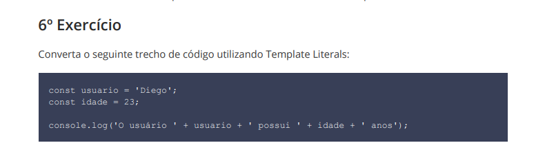

  

  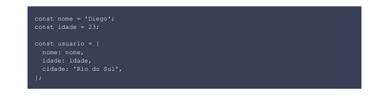

--- 
                                      
## Modulo 2
## /src/modulo-2

 

  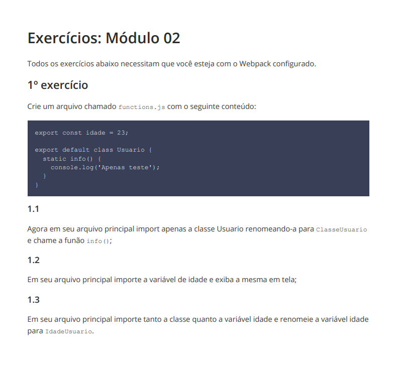

 

## Modulo 3
## /src/modulo-3
 

  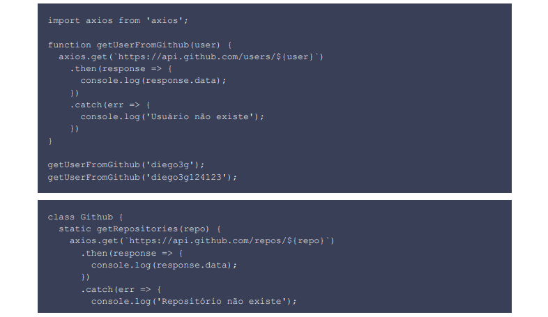

 

  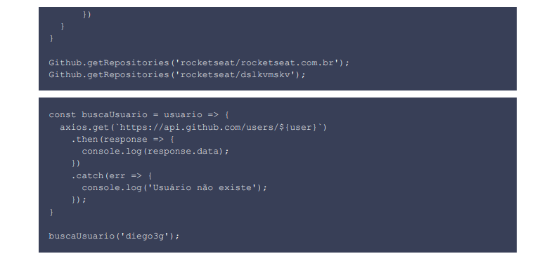

 

